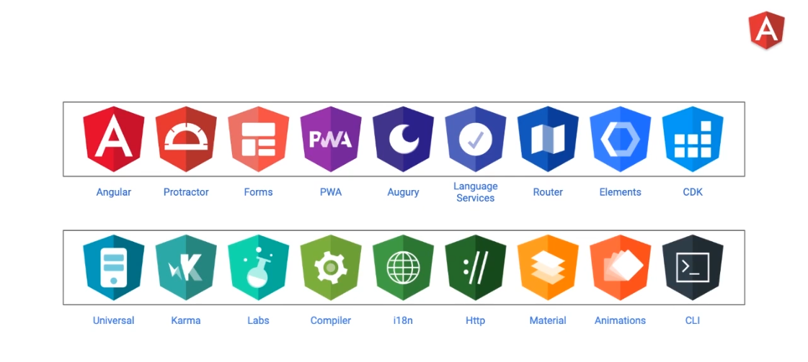
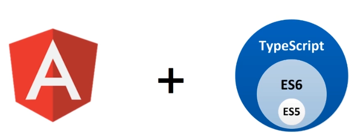
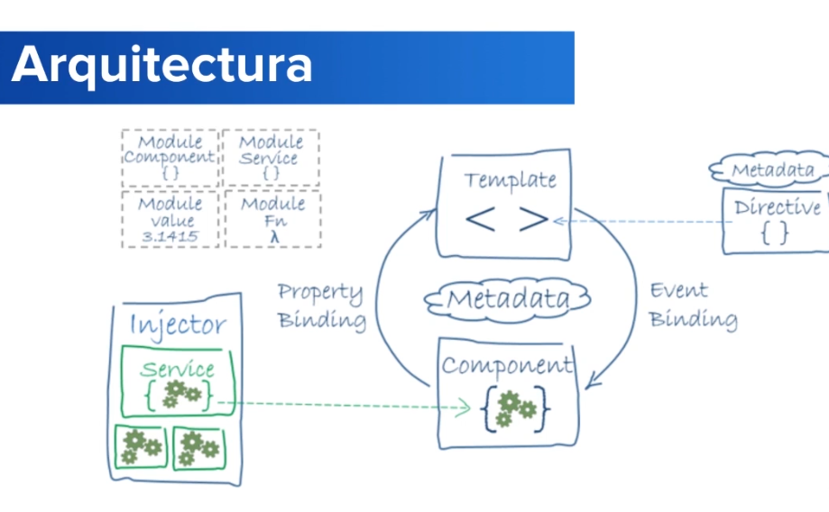

# Introducción a Angular

## 1 - ¿Qué es Angular?

* Framework y plataforma para el desarrollo de aplicaciones
    * HTML
    * TypeScript
* Desarrollado por Google
* Proyecto Open Source
* Desarrollo multiplataforma
    * Web
    * Web Móvil
    * Móvil Nativo
    * Escritorio

## 2 - AngularJS vs Angular

### AngularJS

* AngularJS surge como un framework poderoso, basado en JavaScript
* Two way data binding
* MVC - MVVC ($scope)
* Inyección de Dependencias
* Directivas
* Testing

### Angular

Existe Angular 2, 4, 5, 6, 7, 8, 9, etc. Pero solo es "Angular", no importa la versión. Ya que las versiones significan que el framework evoluciona. 

### Versiones

#### Semantic Versioning

major.minor.patch -> 8.2.6

* Patch releases: 8.0.x (~cada semana)
* Minor releases: 8.0.x (~cada 2 meses)
* Major releases: 8.0.x (~cada 6 meses)
    * Nuevas features
    * Actualizaciones

### Ventajas

#### Cross Platform

* Aplicaciones Web Progresivas (PWA)
    * Alto rendimiento
    * Experiencia Offline
    * Instalación Instantánea
* Aplicaciones móviles Nativas
    * Cordova
    * Ionic
    * NativeScript
* Aplicaciones de Escritorio
    * Windows, Mac, GNU/Linux
    * Acceso a APIs nativos del SO

#### Velocidad y Rendimiento

* Code Generation

    Angular traduce tus plantilla en codigo altamente optimizado.

* Universal

    Despliega tu aplicación sobre Node.js, .Net, PHP, etc.

    Allana el camino para optimizar el SEO.

* Code Splitting

    Las apps cargan rápidamente gracias al Router de Angular.

### Productividad

* Templates

    Se puede crear vistas muy rápidamente

* Angular CLI

    Herramienta de línea de comandos

* IDEs

    Autocompletado de código inteligente, captura de errores y otro utilitarios.

### Historial de Desarrollo Completo

* Testing

    Karma, Protractor

* Animaciones

    API Intuitiva

* Accesibilidad

### Arquitectura

### Entorno de Desarrollo

* Git
* GitHub
* NodeJS
* Visual Studio Code