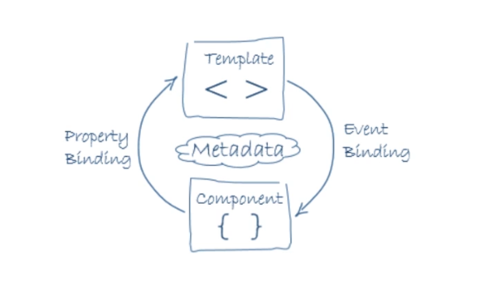
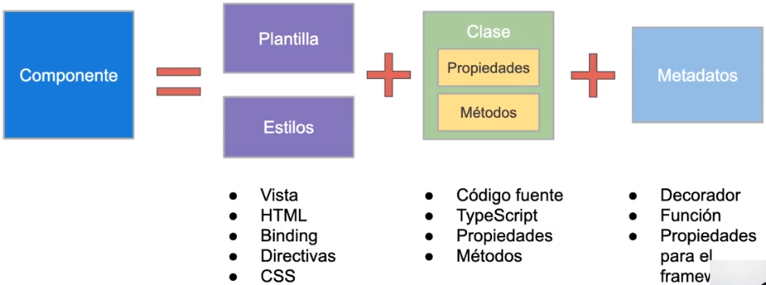
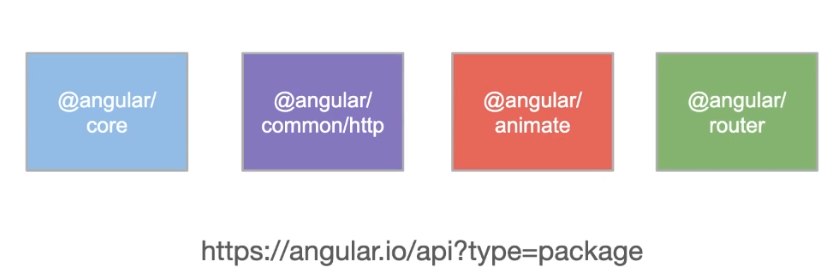

# Componentes y Enrutamiento

## ¿Qué es un componente?





### Componente

``` typescript

import { Component } from '@angular/core'

// Decorador + Metadatos
@Component({
    selector: 'app-root',
    templateUrl: './app.component.html', // plantilla/template
    styleUrls: ['./app.component.css'] // estilos/style
})
export class AppComponent {

    title = 'Axel'

    /*
    Clase
    -Propiedades
    -Métodos
    */

}

```

### ¿De dónde importar?



[https://angular.io/api?type=package](https://angular.io/api?type=package)

## Creando Componentes

### Creando componentes I

* Crear un archivo con extensión .ts
* Usar un sufijo .component.ts
* Definir una clase TypeScript
* Decorar la clase con @Component (metadatos)
* Importar de @angular/core
* Usar opciones de configuración (decorador)

### Creando componentes II

``` javascript

ng generate component <NombreComponente> [Opciones]

```

#### Demo - Generando el componente escuela-digital

``` javascript

ng generate component escuela-digital

/*

Este comando crea 4 archivos

CREATE src/app/escuela-digital/escuela-digital.component.css
CREATE src/app/escuela-digital/escuela-digital.component.html
CREATE src/app/escuela-digital/escuela-digital.component.spec.ts
CREATE src/app/escuela-digital/escuela-digital.component.ts

*/


```

``` typescript

import { Component, OnInit } from '@angular/core'

@Component({
    selector: 'app-escuela-digital',
    templateUrl: './escuela-digital.component.html',
    styleUrls: ['./escuela-digital.component.css'] 
})
export class EscuelaDigitalComponent implements OnInit {

    constructor() {}

    ngOnInit() {
    }

}

```

#### ¿Cómo renderizamos/mostramos el componente?


## Definiendo estilos en componentes

* Angular usa CSS estándar 
* Permite definir "estilos por componente"
* Haciendo posible un diseño modular

### Definiendo estilos I

``` typescript

import { Component } from '@angular/core'

@Component({
    selector: 'app-root',
    template: `<h1>Angular</h1>`,
    styles: ['h1 { font-weight: bold; }'] // Estilo en línea
})
export class AppComponent {}


```

### Definiendo estilos II

``` typescript

import { Component } from '@angular/core'

@Component({
    selector: 'app-root',
    template: `<h1>Angular</h1>`,
    styleUrls: ['./app.component.css'] // Estilos en un archivo
})
export class AppComponent {}


```

## Plantillas en componentes

* Layout
* HTML
* Binding
* Directivas

### Definiendo Plantillas I

``` typescript

import { Component } from '@angular/core'

@Component({
    selector: 'app-root',
    template: `<h1>Angular</h1>`, // Plantilla en línea. Uso de "back ticks": Template strings, Cadena multilinea
    styles: ['h1 { font-weight: bold; }'] 
})
export class AppComponent {}


```

### Definiendo Plantillas II

``` typescript

import { Component } from '@angular/core'

@Component({
    selector: 'app-root',
    templateUrl: './app.component.html', // Plantilla en archivo.
    styleUrls: ['./app.component.css']
})
export class AppComponent {}


```

## Angular Router

* El usuario realiza acciones en la app
* Angular Router permite la navegación de una vista a otra
* Se ingresa una URl en la barra de direcciones
* El navegador se dirige a la página correspondiente
* Click en un link y el navegador carga una nueva página 
* Click en el botón Atrás/Adelante y el navegador carga otra página

``` typescript

// Archivo app-routing.module.ts

import { NgModule } from '@angular/core';
import { Routes, RouterModule } from '@angular/router';
import { DashboardComponent } from './dashboard/dashboard.component';
import { NavbarComponent } from './navbar/navbar.component';
import { SidenavComponent } from './sidenav/sidenav.component';
import { CoursesComponent } from './courses/courses.component';
import { CourseEditComponent } from './course-edit/course-edit.component';

const routes: Routes = [
  {
    path: '',
    component: CoursesComponent,
    pathMatch: 'full' // significa que toda la ruta URL debe coincidir y es consumida por el algoritmo de coincidencia de ruta.
  },
  {
    path: 'navbar', // Url
    component: NavbarComponent // Componente de la Url
  },
  {
    path: 'sidenav',
    component: SidenavComponent
  },
  {
    path: 'dashboard',
    component: DashboardComponent
  },
  {
    path: 'courses',
    component: CoursesComponent
  },
  {
    path: 'course/:id',
    component: CourseEditComponent
  }
];

@NgModule({
  imports: [RouterModule.forRoot(routes)],
  exports: [RouterModule]
})
export class AppRoutingModule { }

```

``` html

<!-- Archivo app.component.html -->

<!-- Muestra dinamicamente un componente en función de la ruta -->
<router-outlet></router-outlet>

```