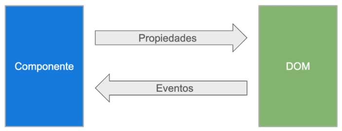
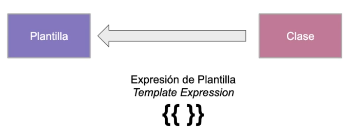
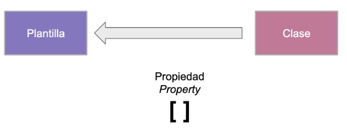
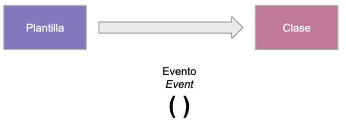

# Data Binding y Pipes

## ¿Qué es data binding?

El Data Binding o enlace de datos es un mecanismo que enlaza los elementos de la interfaz con la parte en la que se arma la información a mostrar. En pocas palabras, es el enlace entre el front y back de nuestra web.

El Data Binding en Angular es la sincronización automática de datos entre el modelo y la vista. La vista siempre muestra los datos que contiene el modelo. Quiere decir que cuando el modelo cambia, la vista se actualiza. Pero también la vista puede cambiar y Angular hará que el modelo también sea actualizado.



## Interpolación



``` html

<div>Curso: {{curso}}</div> <!-- Clase: Propiedades -->
<div>{{'Curso: ' + curso}}</div>
<div>{{50+20*10}}</div>
<div>{{'Curso: ' + getNombreCurso()}}</div> <!-- Clase: Método -->

```

``` html

<div>{{titulo}}</div>
<div></div>

<!-- La suma de 1 + 1 es 2 -->
<p>La suma de 1 + 1 es {{1 + 1}}.</p>

```

## Property Binding



``` html

<!-- Propiedades de clase -->


<button [disabled]="deshabilitado">
    Boton deshabilitado
</button>

```

## Event binding



``` html

<button (click)="onSave()">Save</button>
<button (click)="MostrarEvento($event)">Mostrar Evento</button>

<!-- (click) -> Evento objetivo  -->
<!-- onSave() -> Método de Clase  -->
<!-- $event ->  Genera información detallada del evento -->

```

#### Mas Eventos
[https://developer.mozilla.org/en-Us/docs/Web/events](https://developer.mozilla.org/en-Us/docs/Web/events)

## Attribute, Class and Style Binding

``` html

<!-- Binding en atributo -->
<button [attr.aria-label]="help">Ayuda</button>

<!-- Binding en clase -->
<div [class.special]="special">especial</div>

<!-- Binding en estilo -->
<button [style.color]="esEspecial ? 'red' : 'green'"></button>

```

## ¿Qué son los Pipes?

* Un pipe toma un dato como entrada y lo transforma
* Se establece un "formato" para la salida
* Soporta parámetros

``` html

<p>Mi feecha de nacimiento es {{ fecha | date }}</p>

<!-- 

    Formatos de salida:
    date
    tolowercase
    etc.

-->

```