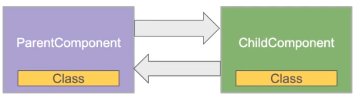
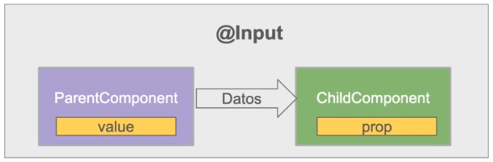
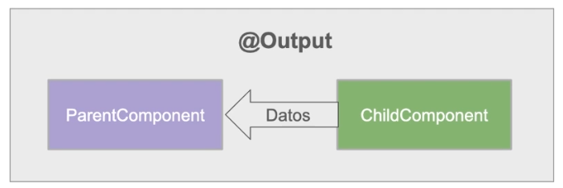
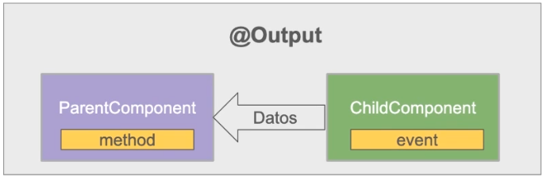
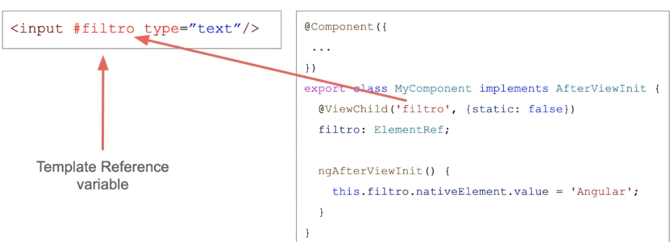

# Directivas y Componentes personalizados

## Directivas Estructurales

* Elemento HTML personalizado
* Atributo HTML personalizado
* Permite extender el vocabulario HTML

## Directivas 

* Directivas personalizadas (custom)
* Directivas Incorporadas en el framework (built-in)

## Directivas personalizadas

``` javascript

@Componente({
    selector: 'app-root',
    templateUrl: './app.component.html',
    stylesUrls: ['./app.component.css']
})
export class AppComponent {

    constructor(){}

}

```

``` html

<!doctype html>
<html lang="es">
    <head></head>
    <body>
        <app-root></app-root><!-- Directiva Personalizada-->
    </body>
</html>

```

## Directivas Estructurales

* Manipulan la estructura del DOM
    * Agregan elementos
    * Eliminan elementos
    * Actualizan elementos

* Directivas Incorporadas Built-In Directives
    * *ngIf
    * *ngFor

## Directiva *ngIf

``` html

<div *ngIf="curso" class="name">{{curso.name}}</div>

<!-- 
    *ngIf -> Atributo, representa una condicional 
    "curso" -> Expresión booleana
-->

```

## Directiva *ngFor

``` html

<ul>
    <li *ngFor="let hero in of heroes">{{hero.name}}</li>
</ul>

<!-- 
    *ngFor -> Directiva, Atributo.
    hero -> Variable de iteración
    heroes -> lista
-->

```

## Directiva ngSwitch

``` html

<div [ngSwitch]="dia">
    <p *ngSwitchCase="'lunes'"></p>
    <p *ngSwitchCase="'martes'"></p>
    <p *ngSwitchCase="'miercoles'"></p>
    <p *ngSwitchCase="'viernes'"></p>
    <p *ngSwitchDefault>Un dia radiante</p>
</div>

```

## Propiedades @Input

``` html

<parent-component>
    <child-component></child-component>
</parent-component>

```



``` html

<parent-component>
    <child-component [prop]="value"></child-component>
</parent-component>

```



## Propiedades @Output y EventEmitter

``` html

<parent-component>
    <child-component></child-component>
</parent-component>

```



``` html

<parent-component>
    <child-component (event)="method($event)"></child-component>
</parent-component>

```



## Accediendo al DOM con @ViewChild

