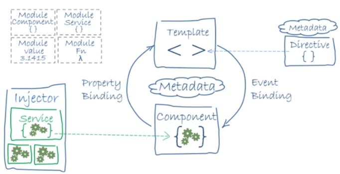

# Módulos, Servicios y Buenas Prácticas

## Modulos en Angular



* Configura el inyector y el compilador para organizar contenido relacionado.

* Es una clase TypeScript marcada con @NgModule

* Consolidan componentes, directivas y pipes en bloques de funcionalidad

* Se suelen enfocar en
    * feature de la aplicación
    * un dominio de la lógica de negocio
    * colección común o utilitarios

* También pueden agregar servicios
* Se pueden cargar al inicio o usando estrategias como lazy loading (asíncrono con el router)

``` javascript

// Decorador
@NgModule({
    //Declaración de componentes, directivas y pipes que forman parte del modulo
    declarations: { 
        AppComponent,
        CoursesListComponent,
        CoursesActionComponent
    },
    //Importa otros módulos con los componentes, directivas y pipes que vayan a necesitar los componentes del modulo actual.
    import: {
        BrowserModule,
        FormsModule
    },
    //Provee servicio que los componente vayan a usar
    providers: [CoursesServices],
    bootstrap: [AppComponent]
})
export class AppModule{}

```

## Inyección de dependencias

* Es un patrón de diseño orientado a objectos
* Permite el paso de objetos como dependencias
* Los objetos se pueden pasar a componentes
* Pueden estar disponibles en toda la aplicación
* El patrón permite la creación de instancias

### Ejemplos

* LoggerService
* LoginService
* EnvironmentService
* PopupService

``` javascript

export class Auto {

    public motor: Motor;
    public llantas: Llantas;
    public descripcion: 'NO DI';

    constructor(){
        this.motor = new Motor();
        this.llantas = new Llantas();
    }

}

```

``` javascript

export class Auto {

    public descripcion: 'DI';
    
    constructor(public motor: Motor, public llantas: Llantas){
    }

}

```

#### Mas información:
[https://angular.io/guide/dependency-injection](https://angular.io/guide/dependency-injection)

## Servicios

* Servicios es una categoría amplica que abarca cualquier valor, función o característica para la aplicación
* Típicamente es una clase con un proposito bien definido
* Debe ser especifico y hacerlo bien

### Ejemplo 1

``` javascript

export class LoggerService {

    log(msg: any){ console.log(msg); }
    error(msg: any){ console.log(msg); }
    warn(msg: any){ console.log(msg); }

}

```

### Ejemplo 2

``` javascript

export class HeroService {

    private heroes: Hero[] = [];

    constructor(
        private backend: BackendService,
        private logger: LoggerService
    ){}

    getHeroes(){
        return this.backend.getAll();
    }

}

```

``` javascript

    //Inyección de dependencias
    constructor(
        private logger: LoggerService,
        private service: HeroService
    ){}

```

#### Mas información:
[https://angular.io/guide/architecture-services](https://angular.io/guide/architecture-services)

## Buenas Prácticas en Angular

* Convenciones para estructura de archivos
* Principio: Single Responsibility
* Convenciones de nombre (naming)
* Estructura de una aplicación
* Buenas prácticas sobre componentes
* Buenas prácticas sobre directivas
* Buenas prácticas sobre servicios
    * Servicios de datos
* Lifecycle hooks

[https://angular.io/guide/styleguide](https://angular.io/guide/styleguide)