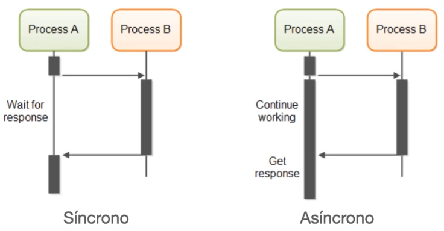
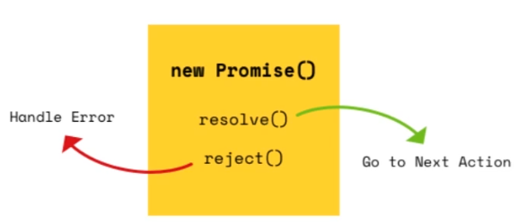
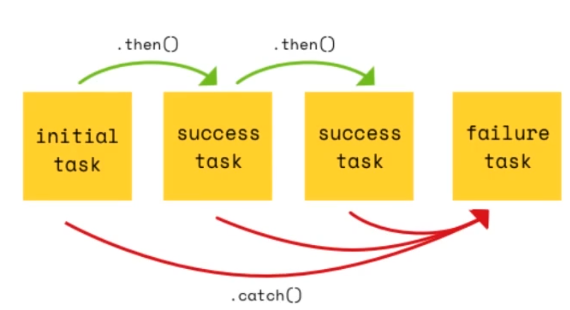
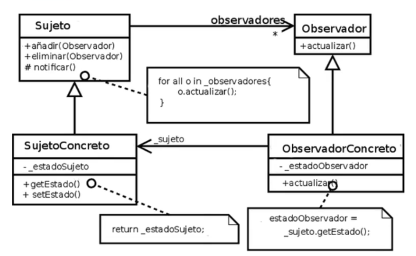
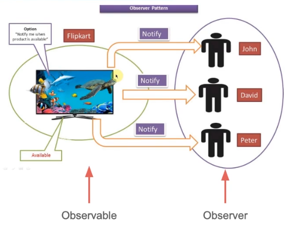
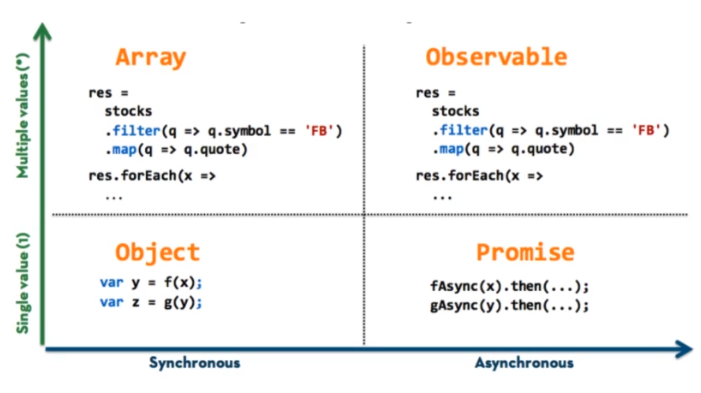
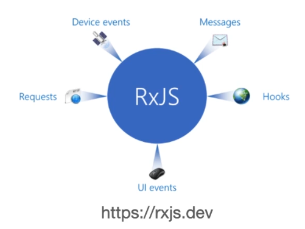

# Asincronica y RxJs

## ¿Qué es una función Asíncrona?

Asincronía en la programación de computadoras hace referencia a la ocurrencia de eventos independientes del flujo principal del programa, asi como la mandera de manejar dichos eventos.

* En algunos lenguajes de programación, el flujo principal del programa se ejecuta en el hilo principal/proceso principal.

* Los eventos independientes del flujo principal del programa, generan nuevos hilos o procesos de ejecución en paralelo.

* No es el caso de JavaScript

* Un programa JavaScript corre en un solo hilo de ejecución.

* Otros eventos se manejan usando asynchronous non-blocking I/O model

    * Código JS se ejecuta de manera secuencial
    * Operaciones I/O no son secuenciales

``` javascript

console.log("Hola mundo Angular");

// "Programa" código para ejecutarse en el futuro
setTimeout(function(){
    console.log("Hasta pronto");
}, 2000)

console.log("Hola otra vez");

```

## Síncrono vs Asíncrono

``` javascript

console.log("Hola mundo Angular");
console.log("Hasta pronto");
console.log("Hola otra vez");

```



## Promesas

* Una Promesa es un objecto que representa la abstrancción del resultado de una operación asíncrona.

* Dicho resultado puede estar disponible ahora o en un futuro.

    * Puede contener un resultado válido
    * Puede contener un error

``` javascript

let primeraPromesa = new Promise((resolve, reject) => {

    // Valor valido
    resolve("¡Éxito!")

})

primeraPromesa.then((mensaje) => {
    console.log("Resultado", mensaje);
})

```

``` javascript

let primeraPromesa = new Promise((resolve, reject) => {

    // Valor con error
    reject("Error");

})

primeraPromesa.then((mensaje) => {
    console.log("Resultado", mensaje);
}).catch((error) => {
    console.log("error", error);
})

```
``` javascript

const promesa = new Promise((resolve, reject) => {
    resolve("Exito")
})

const promesa2 = new Promise((resolve, reject) => {
    resolve("Exito 2")
})

promesa.then(mensaje => {
    console.log("Resultado promesa", mensaje);
    return promesa2;
}).then(mensaje => {
    console.log("Resultado promesa2", mensaje);
}).catch(error => {
    console.log("error", error);
})


```





## Patrón Observer





## Programación Reactiva

* Reactive Programming

* Programación Reactiva es un paradigma de programación asíncrono

* Hace referencia al procesamiento de un flujo de datos de manera asíncrona.

[http://reactivex.io/](http://reactivex.io/)

## RxJS y Observables

* Reactive Extensions for Javascript (RxJS)
* Librería para la programación reactiva con JavaScript
* Provee funciones utilitarias para la creación y el manejo de observables

* Estas funciones utilitarias se pueden usar para: 
    * Convertir código existente asíncrono en observables
    * Iterar sobre los valor en un flujo de datos
    * Mapear valores a diferentes tipos
    * Filtrar flujos de datos
    * Combinar múltiples flujos de datos





[https://rxjs.dev](https://rxjs.dev)

## Observables

* RxJS provee una implementación de un tipo Observable
* RxJs también provee funciones para crear nuevos observables
* Dichas funciones simplifican su proceso de creación para eventos, promesas y otros.

``` javascript

import { from } from 'rxjs'

const datos = from(fetch('/api/endpoint'))

datos.subscribe({
    next(respuesta){ console.log(respuesta) }
    error(error){ console.error("Error: ", error) }
    complete(){ console.error("Completado") }
})

```

``` javascript

import { of } from 'rxjs'
import { map } from 'rxjs/operators'

const nums = of(1, 2, 3);
const cuadrados = nums.pipe(
    map((val: number) => val * val)
);

cuadrados.subscribe(x => console.log(x))

/*

Resultado Consola:
1
4
9

*/

```

``` javascript

async function testObservable(){

    const users = await fetch("https://randomuser.me/api?results=5");
    const datos = from(users.json());

    datos.subscribe({
        next(respuesta){
            console.log("Respuesta", respuesta);
        },
        error(error){
            console.log("Error", error);
        },
        complete(){
            console.log("Completado");
        }
    })

}

testObservable();

```