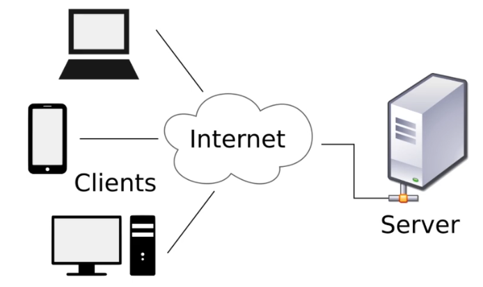
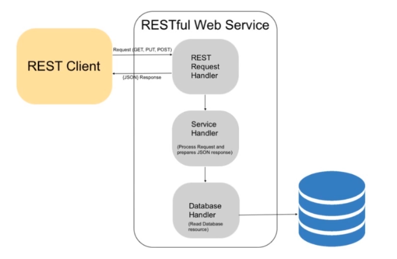
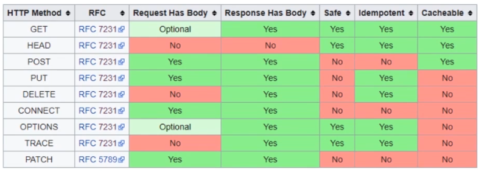
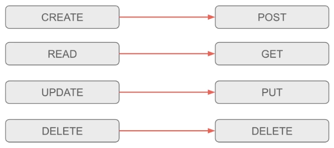

# Comunicación HTTP

## Arquitectura cliente-servidor

Es una arquitectura de red informática en la que varios clientes solicitan y reciben servicios de un servidor centralizado.

* Los clientes proporcionan una interfaz para la solicitud de servicios y mostrar resultados

* Los servidores esperan las solicitudes para responder a los mismos

* Normalmente un servidor provee una interfaz estandarizada y transparente a los cliente.



## REST y servicios RESTful

### REST

Representational State Transfer (REST)

* Es un patrón de arquitectura para la creación de servicios web

* Considera restricciones para su arquitectura

* Restricciones de arquitectura
    * Client-Server
    * Statelees
    * Cacheable
    * Uniform Interface
    * Layered System

### Servicios RESTful

RESTful se usa para referirse a servicios web que implementan la arquitectura REST.



## Métodos HTTP

* HTTP define un conjunto de métodos de petición para indicar las acciones a realizar sobre un recurso.

* Estos métodos suelen llamarse también verbos HTTP (HTTP verbs)



[https://developer.mozilla.org/en-US/docs/Web/HTTP/Methods](https://developer.mozilla.org/en-US/docs/Web/HTTP/Methods)

* Las RESTful APIs permiten ejecutar operaciones CRUD.
    * Create
    * Read
    * Update
    * Delete



## Peticiones HTTP en Angular

* La mayoría de aplicaciones front-end se comunican con los servicios de back-end a través del protocolo HTTP

* Navegadores modernos admiten dos APIs para estas solicitudes
    * XMLHttpRequest
    * fetch API

* Angular provee un cliente denomicado HttpClient(@angular/common/http)

* HttpClient ofrece un API HTTP simplificado para aplicaciones Angular (basado en la interfaz XMLHttpRequest)

``` typescript

// importar módulo
import { HttpClientModule } from "@angular/common/http"

@NgModule({
    imports: [
        BrowserModule,
        HttpClientModule // Uso del módulo en imports
    ],
    providers: [],
    bootstrap: [AppComponent]
})
export class AppModule {}

```

``` typescript

    class HttpClient {
        delete(url: string, options: {...} = {}): observable<any>
        get(url: string, options: {...} = {}): observable<any>
        post(url: string, body: any, options: {...} = {}): observable<any>
        put(url: string, body: any, options: {...} = {}): observable<any>
    }

```

[https://angular.io/api/common/http/HttpClient](https://angular.io/api/common/http/HttpClient)

``` typescript

// Servicio

getDatos(): observable<Datos>{
    return this.http.get<Datos>('/api/endpoint')
}

```

``` typescript

// Componente

mostrarDatos(){

    this.datosService.getDatos().subscribe((respuesta: Datos) => this.datos = respuesta)

}

```

## Manejo de Errores

* ¿Qué sucede si la petición al servidor falla?
* ¿Qué pasa si tenemos una conexion intermitente?


* Es ideal dar una retroalimentación al usuario
* Mostrar el objeto de error que retorna el servidor no es una buena idea (generalmente)


``` typescript

// Servicio

getDatos() {

    try {
        const res = getDatos('/api/endpoint')
    } catch (error) {
        // manejamos el error
    }

}

```

``` typescript

// Servicio

import { Observable } from 'rxjs';
import { catchError } from 'rxjs/operators';

getDatos(): Observable<Datos> {

    return this.http.get<Datos>('/api/endpoint')
    .pipe(
        // Captura el error y se le gestiona en una función
        // catchError: Es un operador
        catchError(this.manejarError)
    )

}

manejarError(error: HttpErrorResponse){

    // Error en el lado del cliente
    if(error.error instanceof ErrorEvent){
        console.error('Ocurrio un error', error.error.message)
    }
    else { // Error en el lado del servidor
        console.error(
            `Backend retorna codigo de error ${error.status}` +
            `Cuerpo de respuesta: ${error.error}`
        );
    }

    // Retorna un Error como observable
    return throwError('Ocurrió un error inesperado');
}

```

* Estrategias
    * Capturar y reemplazar (catch and replace)
    * Capturar y relanzar (Catch and Rethrow)

``` typescript

import { Observable } from 'rxjs';
import { catchError } from 'rxjs/operators';

// Capturar y reemplazar (catch and replace)

getDatos(): Observable<Datos> {

    return this.http.get<Datos>('/api/endpoint')
    .pipe(
        catchError(error => of([]))
        // catch: catchError
        // replace: of([])
    )

}

```

``` typescript

import { Observable } from 'rxjs';
import { catchError } from 'rxjs/operators';

// Capturar y relanzar (Catch and Rethrow)

getDatos(): Observable<Datos> {

    return this.http.get<Datos>('/api/endpoint')
    .pipe(
        catchError(error => throwError(error))
        // catch: catchError
        // Rethrow: throwError(error)
    )

}

```