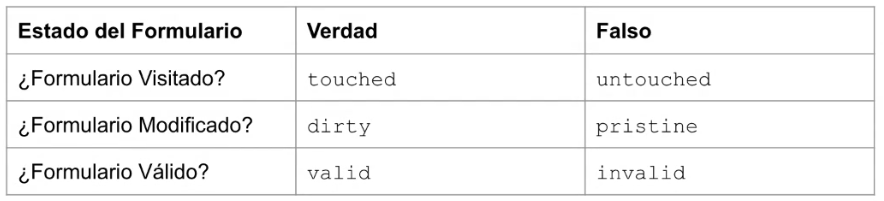

# Formularios basados en plantillas

## Manejando Formularios

* ¿Qué se puede hacer con formularios?
  * Iniciar sesión en una aplicación
  * Actualizar perfil de un usuario
  * Ingresar los datos de un pedido online
  * Otras tareas de ingreso de datos

* Angular proporciona dos enfoques para menejar de entradas de usuario a través de formularios
* En ambos casos se efectúa:
  * Captura de eventos de entrada
  * Validación de entradas de usuario
  * Creación de un modelo de formulario
  * Creación de un modelo de datos para actualizar y detectar cambios

* Formulario basados en plantillas (Template-driven forms)
* Formularios reactivos (Reactive forms)

* Formulario basados en plantillas (Template-driven forms)
  * Formularios simples
  * Lógica de formulario básicos
  * Son fáciles de agregar

``` html

<input id="nombre"
    name="nombre"
    requerid
    minlength="4"
    [(ngModel)]="nombre"
    #nombre="ngModel"
/>

<!-- 

#nombre -> Variable que permite verificar el estado del input

-->

```

``` html

<div *ngIf="nombre.invalid && (nombre.dirty || nombre.touched)">

    <div *ngIf="nombre.errors.required">
        nombre is requerid
    </div>

    <div *ngIf="nombre.errors.minlength">
        nombre must be at least 4 characters long.
    </div>

</div>

```

## Entiendo el estado de un formulario

* Angular permite verificar el estado de un formulario a través de los siguientes criterios
  * ¿El formulario ha sido visitado?
  * ¿El formulario ha sido modificado?
  * ¿El formulario es válido?



``` html

  <form #formAdd="ngForm">
    <div class="form-group">
      <label for="name">Nombre</label>
      <input
        type="text"
        class="form-control"
        id="name"
        name="name"
        placeholder="Ingrese Nombre"
        [(ngModel)]="nombre"
        #name="ngModel"
        requerid
      />
    </div>
  </form>

  <div>
    <pre>
      Form.valid: {{formAdd.form.valid}}
      Form.invalid: {{formAdd.form.invalid}}
      Form.touched: {{formAdd.form.touched}}
      Form.untouched: {{formAdd.form.untouched}}
      Form.pristine: {{formAdd.form.pristine}}
      Form.dirty: {{formAdd.form.dirty}}
    </pre>
  </div>

```

## Accediendo al formulario con @ViewChild

``` typescript

export class MyComponent {

  // Captura del formulario (ngForm) via la variable de plantilla
  @ViewChild('form', {static: false})
  form: FormControl;

  // Reinicialización del formulario
  onSubmit(){
    if(this.form.valid){
      this.form.reset();  
    }
  }

}

```

## FormControl

* Es un objeto que permite "rastrear" el valor y estado de validación de un control de formulario

* Implementa la mayor parte de la funcionalidad básica para acceder el valor, estado de validación. interacciones de usuario y eventos

[https://angular.io/api/forms/FormControl](https://angular.io/api/forms/FormControl)

## Validadores

* Los formularios basados en plantilla agregan los mismos atributos de validación que un formulario HTML nativo.

* Angular usa directivas para hacer coincidir estos atributos con funciones de validación del propio framework.

[https://developer.mozilla.org/en-US/docs/Web/Guide/HTML/HTML5/Constraint_validation](https://developer.mozilla.org/en-US/docs/Web/Guide/HTML/HTML5/Constraint_validation)

## Errores de validación

``` html

<input id="nombre"
    name="nombre"
    requerid
    minlength="4"
    [(ngModel)]="nombre"
    #nombre="ngModel"
/>

```

``` html

<div *ngIf="nombre.invalid && (nombre.dirty || nombre.touched)">

    <div *ngIf="nombre.errors.required">
        nombre is required
    </div>

    <div *ngIf="nombre.errors.minlength">
        nombre must be at least 4 characters long.
    </div>

</div>

```

## Clases CSS de control

* Tal como en AngularJS, Angular refleja automáticamente muchas propiedades de control en el elementos de formulario como clases CSS.

* Se puede usar estas clases para dar un estilo de acuerdo al estado del formulario/campo.

### Clases

* .ng-valid
* .ng-invalid
* .ng-pending
* .ng-pristine
* .ng-dirty
* .ng-untouched
* .ng-touched

## ngModel y el two-way data binding

``` html

<input
    type="text"
    class="form-control"
    id="name"
    name="name"
    placeholder="Ingrese Nombre"
    [(ngModel)]="nombre"
    #nombre="ngModel"
    requerid
    minlength="4"
/>

```
