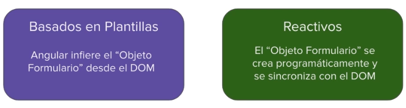

# Formularios Reactivos

## Formularios



## Formularios Reactivos

Los Formularios Reactivos proveen un enfoque basado en modelos de datos para el manejo de entradas de usuario

``` typescript

import { ReactiveFormModule } from '@angular/forms'

@NgModule({
    imports: [
        // otros imports
        ReactiveFormModule
    ]
})
export class AppModule { }

```

``` typescript

import { Component } from '@angular/core'
import { FormControl } from '@angular/forms'

@Component({
    // ...
})
export class NameEditorComponent {

    name = new FormControl('');

}

```

``` html

<label>
    Name:
    <input type="text" [formControl]="name" >
</label>

```

### Ejemplo

``` typescript

import { Component } from '@angular/core'
import { FormGroup, FormControl } from '@angular/forms'

@Component({
    // ...
})
export class NameEditorComponent implements OnInit{

    courseAddForm: FormGroup;

    constructor() { }

    ngOnInit() {
        this.courseAddForm = new FormGroup({
            'name': new FormControl('Angular'), // se puede asignar un valor iniciarl.
            'description': new FormControl(null)
        })
    }

    onSubmit() {
        console.log('Submit', this.courseAddForm);
    }

}

```

``` html

<form [formGroup]="courseAddForm" (ngSubmit)="onSubmit()">
    <label>
        Name:
        <input [formControlName]="'name'" type="text" >
    </label>
    <label>
        Description:
        <input formControlName="description" type="text" >
    </label>
    <button type="submit">Guardar</button>
</form>

```

## Agrupando Controles

``` typescript

import { Component } from '@angular/core'
import { FormGroup, FormControl } from '@angular/forms'

@Component({
    // ...
})
export class NameEditorComponent implements OnInit{

    userForm: FormGroup;

    constructor() { }

    ngOnInit() {
        this.userForm = new FormGroup({
            username: new FormControl(null),
            email: new FormControl(null),
            address: new FormGroup({ // FormGroup anidado
                streetAddres: new FormControl(null),
                city: new FormControl(null),
                country: new FormControl(null),
            })
        })
    }

    onSubmit() {
        console.log('Submit', this.userForm);
    }

}

```

## Validación


### Validadores del Framework

* min
* max
* required
* email
* minLength
* maxLength
* pattern

### Ejemplo

``` typescript

import { Component } from '@angular/core'
import { FormGroup, FormControl } from '@angular/forms'

@Component({
    // ...
})
export class NameEditorComponent implements OnInit{

    courseAddForm: FormGroup;

    constructor() { }

    ngOnInit() {
        this.courseAddForm = new FormGroup({
            'name': new FormControl('Angular', Validators.required),
            'description': new FormControl(null, [Validators.required, Validators.minLength(4)])
        })
    }

    onSubmit() {
        console.log('Submit', this.courseAddForm);
    }

    get price(){
        return this.courseAddForm.get('price');
    }

}

```

``` html

<form [formGroup]="courseAddForm" (ngSubmit)="onSubmit()">
    <label>
        Name:
        <input [formControlName]="'name'" type="text" >
    </label>
    <div *ngIf="courseAddForm.get('name').invalid && (courseAddForm.get('name').dirty || courseAddForm.get('name').touched)">

    El nombre es requerido

    </div>
    <label>
        Description:
        <input formControlName="description" type="text" >
    </label>
     <div *ngIf="courseAddForm.get('description').invalid && (courseAddForm.get('description').dirty || courseAddForm.get('description').touched)">

        <div *ngIf="courseAddForm.get('description').getError('required')">
            la descripción es requerida
        </div>

        <div *ngIf="courseAddForm.get('description').getError('minLength')">
            la descripción debe tener al menos 4 caracteres.
        </div>

    </div>
    <button type="submit">Guardar</button>
</form>

```

## Validadores Personalizados

``` typescript

customValidator(param: any): ValidatorFn {

    return (control: AbstractControl): { [key: string]: any } | null => {
        if(customLogicHere){
            return {
                'param': value
            }
        }
        return null;
    }

}

```

### Ejemplo

``` typescript

import { Component } from '@angular/core'
import { FormGroup, FormControl } from '@angular/forms'

@Component({
    // ...
})
export class NameEditorComponent implements OnInit{

    courseAddForm: FormGroup;

    constructor() { }

    ngOnInit() {
        this.courseAddForm = new FormGroup({
            'name': new FormControl('Angular', Validators.required),
            'price': new FormControl(null, [Validators.required, minPrice(10))
        })
    }

    onSubmit() {
        console.log('Submit', this.courseAddForm);
    }

    minPrice(param: any): ValidatorFn {

        return (control: AbstractControl): { [key: string]: any } | null => {
            if(control.value !== undefined && control.value <= minPrice){
                return {
                    'minPrice': true
                }
            }else{
                return null;
            }
        }

    }

}

```

``` html

<form [formGroup]="courseAddForm" (ngSubmit)="onSubmit()">
    <label>
        Name:
        <input [formControlName]="'name'" type="text" >
    </label>
    <div *ngIf="courseAddForm.get('name').invalid && (courseAddForm.get('name').dirty || courseAddForm.get('name').touched)">

    El nombre es requerido

    </div>
    <label>
        Price:
        <input formControlName="price" type="text" >
    </label>
     <div *ngIf="courseAddForm.get('price').invalid && (courseAddForm.get('price').dirty || courseAddForm.get('price').touched)">

        <div *ngIf="courseAddForm.get('description').getError('required')">
            la descripción es requerida
        </div>

        <div *ngIf="courseAddForm.get('description').getError('minPrice')">
            El precio debe ser mayor a 10
        </div>

    </div>
    <button type="submit">Guardar</button>
</form>

```

### Reaccionando a los Cambios

``` typescript

import { Component } from '@angular/core'
import { FormGroup, FormControl } from '@angular/forms'

@Component({
    // ...
})
export class NameEditorComponent implements OnInit{

    courseAddForm: FormGroup;
    descripcionFormControl: FormControl = new FormControl(null, [Validators.required, Validators.minLength(4)])

    constructor() { }

    ngOnInit() {
        this.courseAddForm = new FormGroup({
            'name': new FormControl('Angular', Validators.required),
            'description': this.descripcionFormControl
        })

        // Formulario: Cambios en valor
        this.courseAddForm.valueChanges.subscribe(value => console.log(value))

        // Formulario: Cambios de estado
        this.courseAddForm.statusChanges.subscribe(value => console.log(value))

        // Valor: Cambios en valor
        this.descripcionFormControl.valueChanges.subscribe(value => console.log(value))

        // Valor: Cambios de estado
        this.descripcionFormControl.statusChanges.subscribe(value => console.log(value))

    }

    onSubmit() {
        console.log('Submit', this.courseAddForm);
    }

}

```
